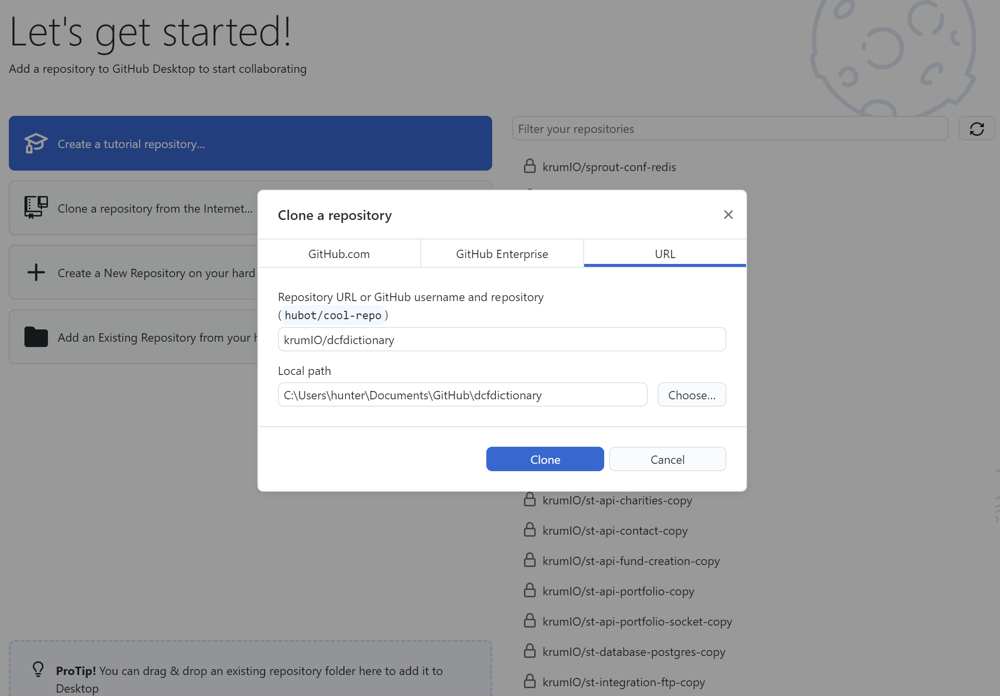
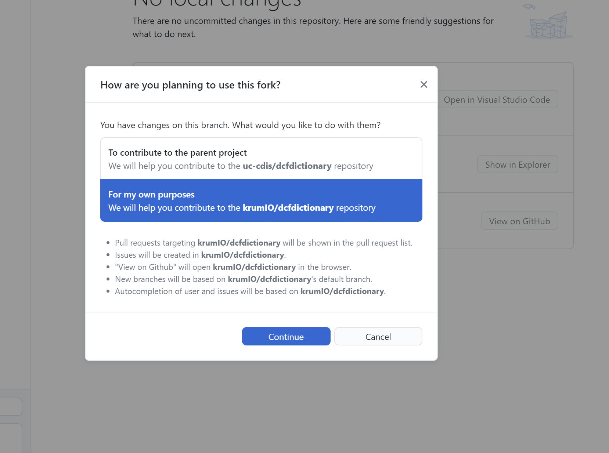
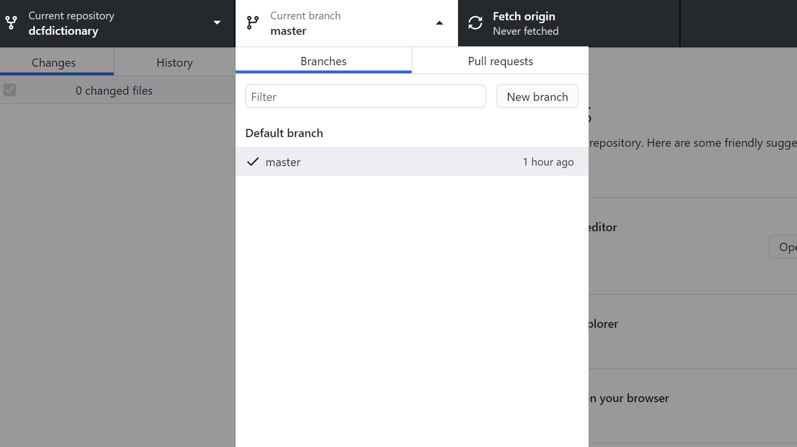
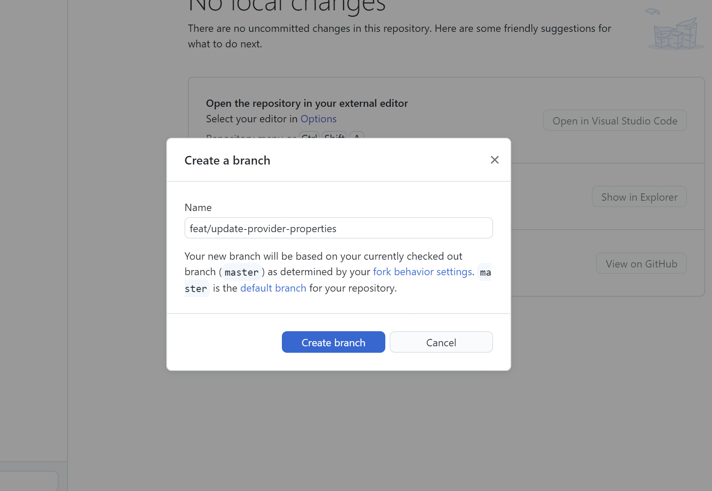
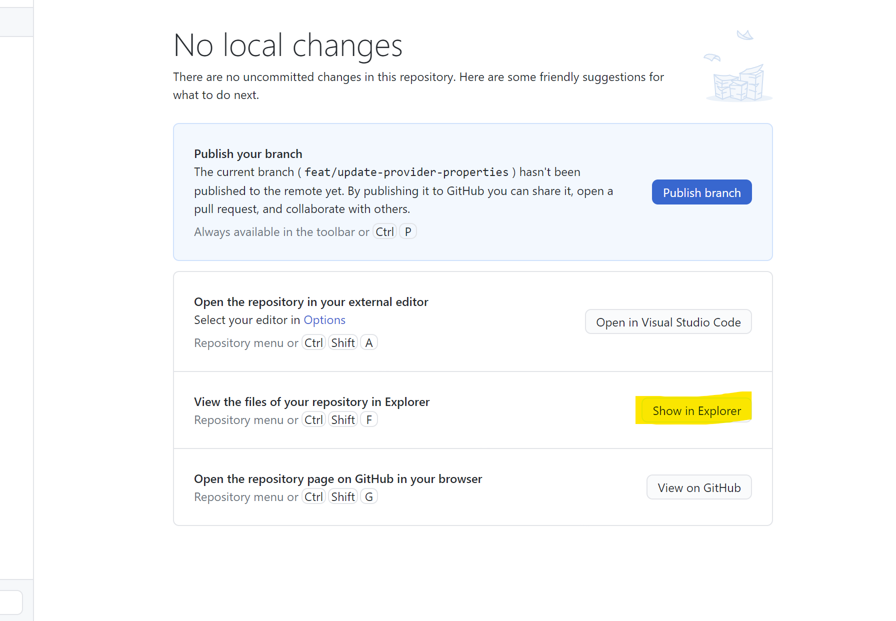
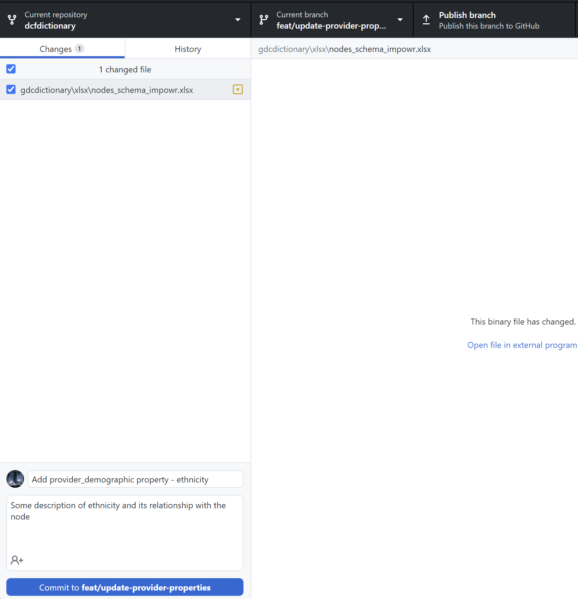
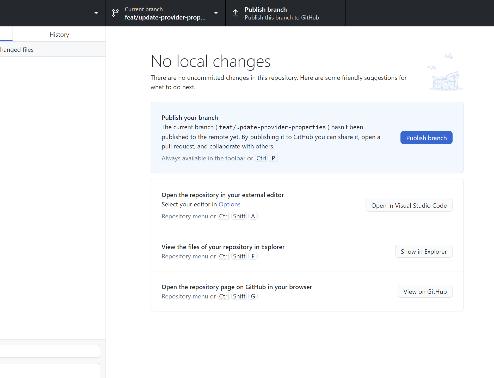
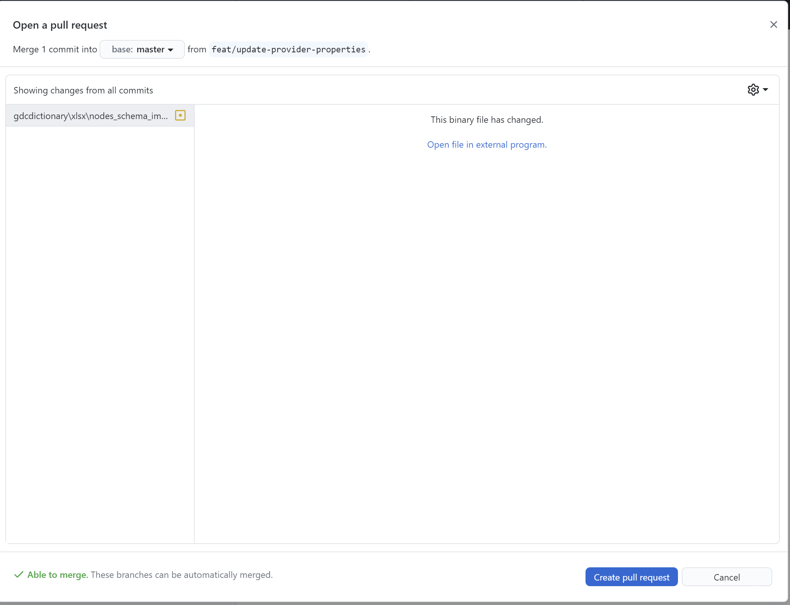

# IMPOWR Data Dictionary

This repository hosts our Data Dictionary (DD) and accompanying utilities.  These utilities include tools for converting the dictionary between XLSX, the definitive YAML spec, and the JSON representation that is to be referenced via Helm values.

## Repository Flow

1. **Update Dictionary**:
    - Our **dictionary maintainer** is expected to update the contents of the **XLSX** file at path **`gdcdictionary/xlsx/nodes_schema_impowr.xlsx`**
2. **Propose Changes**:
    - Once the updates are performed on the file, the **dictionary maintainer** is expected to open a pull request in Github containing the new file contents
3. **Generate Specification**:
    - After the pull request has been merged, a **developer** or automation will run the following scripts:
        - Convert the XLSX file to a rendered set of YAML files
        ```bash
        python3 dictionaryutils/setup.py install --force
        python3 dictionaryutils/utils/tsv2yaml.py -i gdcdictionary/xlsx/ -o gdcdictionary/schemas/ -e xlsx
        ```

        - Aggregate the YAML files and dump the specification to a single JSON file
        ```bash
        python3 dictionaryutils/utils/dump_schema.py
        ```
4. **Deploy Dictionary**:
    - With the new YAML spec and JSON dump created, a **developer** or automation will then deploy the dictionary updates to our data commons
        - The JSON artifact will be uploaded to a bucket for hosting
        - The IMPOWR gen3 **Helm chart** will be updated to reference the latest JSON dump

## Updating the Dictionary

The IMPOWR data dictionary was initialized via the DCF data dictionary provided by the gen3 team.  The DCF data dictionary is a baseline dictionary, it allows users to create their own dictionaries by serving as a start point for new dictionaries. The
flexibility of the DCF dictionary makes the process of creating a new dictionary relatively simple.  You may read more official documentation on the DCF data dictionary [here](https://github.com/uc-cdis/dcfdictionary).

### XLSX Format

Our dictionary is maintained via the XLSX file format.  We selected this format because it is the friendliest for non-developers that are more focused on research and analysis.  You will find that there are **3 sheets**:
- **nodes_impowr**
    - Nodes in the data model are strongly typed and individually defined for a specific data type
    - Nodes are grouped up into categories that represent broad roles for the node such as `analysis` or `biospecimen`
    - Nodes have a series of **`systemProperties`**; these properties are those that will be automatically filled by the system unless otherwise defined by the user
    - Nodes may be the parent or child of another node
        - These node relationships are expressed as a **link** which points a child to its parent
            - **`link_name`**:  name of the relationship
            - **`link_label`**:  description of the relationship
            - **`link_backref`**:  child type
            - **`link_target`**:  parent type
            - **`link_multiplicity`**:  type of relationship, e.g. `one_to_many`, `many_to_one`, `many_to_many`, etc.
            - **`link_required`**:  whether the relationship is required or not (`True`, `False`, or empty)
- **variables_impowr**
    - Each node will have a collection of **`properties`**.  Each row in this sheet is represents a singular **`property`** of a specified node
    - Properties will have a specified **`type`**
        - Possible types include `string`, `number`, `boolean`, `integer`, `enum`, etc.
            - `enum` indicates that the property has a defined set of values that it my take
    - You may also configure a property's **`maximum`**, **`minimum`**, **`default`** value, **`format`**, etc.
- **enums_impowr**
    - Each `enum` property will list its available options in this sheet
    - In this sheet, a given row will specify the node, property, and value for an `enum` option

### Github Desktop

It is likely that our **dictionary maintainer** will be using [**Github Desktop**](https://desktop.github.com/) to interact with our repository and propose dictionary changes.  There will be a general order of operations that is conducive to this process:

1. **If this is your first time opening Github Desktop,** then you will need to clone (download) this repository to your local machine.
    - You should see an option **`+ Clone a repository from the Internet...`**
    - Click this option to prompt the **`Clone a repository`** modal
    - Select the **`URL`** tab in the modal
    - Enter `krumIO/dcfdictionary`
    - Click **`Clone`**
    
    - Select `For my own purposes` and click `Continue`
    

2. Create a new branch for proposing dictionary changes
    - Open the branch dropdown and click **`New Branch`**
    
    - Provide a relatively descriptive but concise branch name
    
    - Click **`Create branch`**

3. Open the XLSX dictionary file in **Excel**
    - Either click **`Show in Explorer`** or use the keybind **`Ctrl/Command + Shift + F`** to open your file explorer
    
    - Navigate the folder structure to **`/gdcdictionary/xlsx/nodes_schema_impowr.xlsx`**
    - Open the XLSX file in Excel

4. Perform your dictionary modifications, save the XLSX file, and close Excel

5. Commit your changes and create a pull request
    - After saving the XLSX file, **Github Desktop** will automatically detect and display your active changes on the branch.
    - Document your changes with a commit message and description
    
    - Publish your branch to our remote repository by clicking **`Publish branch`**
    
    - Create a pull request for review
        - Click **`Preview Pull Request`**
        
        - Click **`Create pull request`**
        
            - This will open Github in your web browser where you will be provided an additional opportunity to describe your changes and finally **`Create pull request`**

## Scripts

1. Install dependencies
```bash
python3 dictionaryutils/setup.py install --force
```

2. Convert XLSX to YAML
```bash
python3 dictionaryutils/utils/tsv2yaml.py -i gdcdictionary/xlsx/ -o gdcdictionary/schemas/ -e xlsx
```

3. Convert YAML to XLSX
```bash
python3 dictionaryutils/utils/yaml2tsv.py -i gdcdictionary/schemas/ -o gdcdictionary/xlsx/ -e xlsx -d impowr
```

4. Dump YAML schema to JSON
```bash
python3 -m dictionaryutils.utils.dump_schema
```
